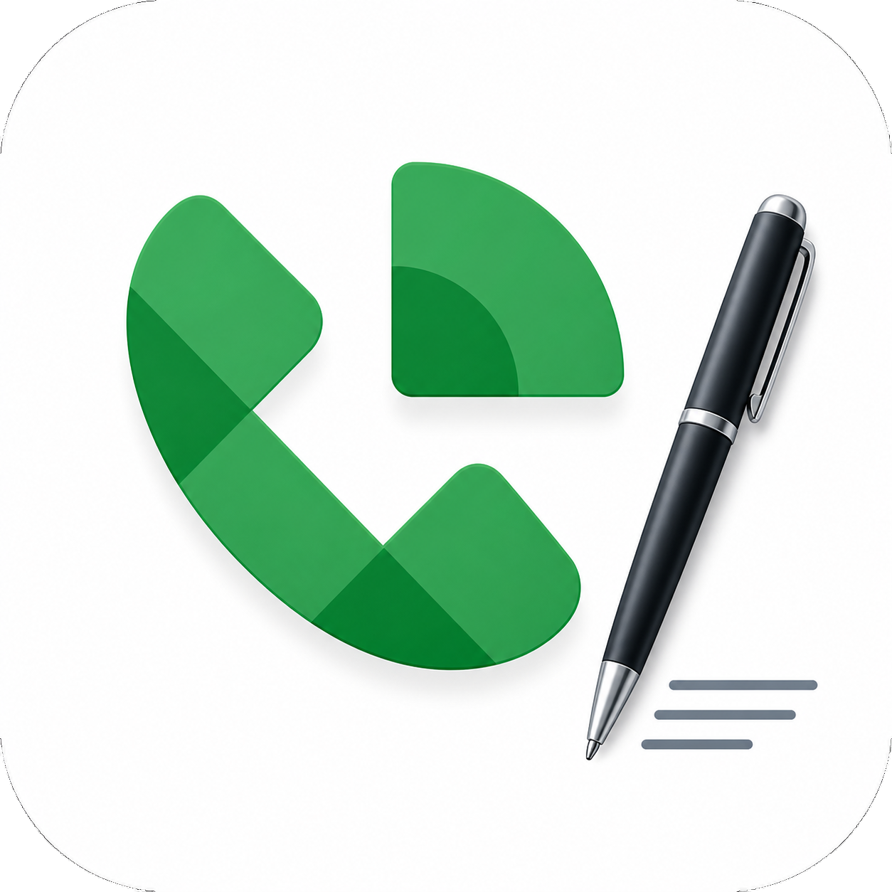

<p align="center">
  
</p>

# GoogleVoice Scribe

GoogleVoice Scribe is a Chromium extension plus a local Windows transcription
server for recording outgoing Google Voice calls. The extension captures Google
Voice tab audio and microphone audio, streams PCM chunks to `127.0.0.1`, and the
server writes local recordings and transcripts using local GPU inference.

The project is designed for local-first use on Windows with an NVIDIA GPU. Model
weights are not stored in this repository or bundled in releases.

## Release Packages

GitHub releases contain two assets:

- `GoogleVoiceScribeSetup-v0.2.0-win-x64.exe` - per-user Windows installer for the local server and control app.
- `GoogleVoiceScribeExtension-v0.2.0.crx` - packaged Chromium MV3 extension.

The installer is intentionally thin. It installs the app under
`%LOCALAPPDATA%\GoogleVoiceScribe`, creates a local `.venv`, installs the
Python/CUDA runtime dependencies, creates Start Menu/Desktop shortcuts, and
launches the control app. Granite Speech and Gemma GGUF model files are
downloaded into the user's Hugging Face cache on demand.

## Requirements

- Windows 10/11.
- NVIDIA GPU with current drivers. The default development target is RTX 3070.
- Python 3.12 available through the Windows `py` launcher or `python` on PATH.
- Chromium or Chrome 116+.
- Network access for first-time dependency/model downloads.

## Install From A GitHub Release

1. Download and run `GoogleVoiceScribeSetup-v0.2.0-win-x64.exe`.
2. Wait for the installer to finish dependency setup and launch the control app.
3. Click "Start Server" in the control app.
4. Confirm the local service is healthy at `http://127.0.0.1:8765/health`.
5. Download `GoogleVoiceScribeExtension-v0.2.0.crx`.
6. Open `chrome://extensions`, enable Developer mode, and drag the `.crx` file
   onto the extensions page. If your browser blocks local CRX sideloading, load
   `extension/` as an unpacked extension from a source checkout instead.
7. Open `https://voice.google.com/`, click the extension icon to arm recording,
   then start an outgoing call.

If microphone capture is blocked, open the extension options page and grant
microphone access before arming again.

## Development Setup

```cmd
py -3.12 -m venv .venv
.\.venv\Scripts\python.exe -m pip install --upgrade pip
.\.venv\Scripts\python.exe .\scripts\install_service_deps.py
.\.venv\Scripts\python.exe .\scripts\start_service.py
```

Load `extension/` as an unpacked Chromium extension during development.

## Configuration

Configuration is stored in `%APPDATA%\GoogleVoiceScribe\config.env` and can be
edited from the control app. Environment variables with the same names override
the config file. Copy `.env.example` for the complete set of supported options.

Important defaults:

- API URL: `http://127.0.0.1:8765`
- Recordings folder: `%USERPROFILE%\Documents\Google Voice Transcripts`
- Speech model: `ibm-granite/granite-speech-4.1-2b-plus`
- Title model: `unsloth/gemma-4-E4B-it-GGUF`
- Incremental mixed transcription: `GV_INCREMENTAL_TRANSCRIPTION=1`
- Incremental `you`/`callee` reference transcription: `GV_INCREMENTAL_REFERENCE_TRANSCRIPTION=1`
- Reference decode cap: `GV_REFERENCE_MAX_NEW_TOKENS=128`
- Strict offline mode after caching: `GV_HF_LOCAL_FILES_ONLY=1`
- Keep large WAV files in final transcript folders: `GV_KEEP_WAV_FILES=0`
- GPU acceleration enabled unless CPU mode is forced: `GV_FORCE_CPU=0`

Disable 3-track incremental reference transcription on weaker GPUs:

```cmd
set GV_INCREMENTAL_REFERENCE_TRANSCRIPTION=0
.\.venv\Scripts\python.exe .\scripts\start_service.py
```

## Output

Completed calls are moved from `_tmp` into a date folder:

```text
YYYY-MM-DD/
  YYYYMMDDTHHMMSS-0700_subject/
    audio.opus
    transcript.json
    session.json
    conversation.txt
```

`conversation.txt` is the human-readable transcript:

```text
[You]: ...
[Callee]: ...
```

`audio.opus` is a compressed playback copy of the mixed recording. By default,
large WAV files are used as temporary processing files and removed before the
completed transcript folder is finalized. Set `GV_KEEP_WAV_FILES=1` to retain
`audio.wav`, `you.wav`, and `callee.wav` for debugging or reprocessing.

## Maintenance Commands

Backfill conversations:

```cmd
.\.venv\Scripts\python.exe .\scripts\backfill_conversations.py
```

Create missing compressed playback files:

```cmd
.\.venv\Scripts\python.exe .\scripts\compress_recordings.py
```

Benchmark a simulated 15-minute call:

```cmd
.\.venv\Scripts\python.exe .\scripts\benchmark_pipeline.py ^
  --duration-seconds 900 ^
  --service-url http://127.0.0.1:8765 ^
  --chunk-frames 4096 ^
  --sample-rate 48000 ^
  --realtime-upload ^
  --progress-every 100
```

Compare warm GPU vs CPU pipeline performance:

```cmd
.\.venv\Scripts\python.exe .\scripts\benchmark_cpu_gpu.py ^
  --source-session "C:\Users\Pew Pew Control\Documents\Google Voice Transcripts\YYYY-MM-DD\SESSION_FOLDER" ^
  --duration-seconds 900
```

The comparison uses a short warmup replay by default, then two measured realtime
runs for each mode.

## Build Release Assets

```cmd
.\.venv\Scripts\python.exe .\scripts\build_extension.py
.\.venv\Scripts\python.exe .\scripts\build_installer.py
```

The generated `.crx` and installer `.exe` are written to `dist/`. The CRX key is
stored locally under `build\secrets` and is ignored by Git.

To create or update the GitHub release for `v0.2.0`:

```cmd
.\.venv\Scripts\python.exe .\scripts\release.py
```

## Legal

This project is MIT licensed. Model weights and runtime dependencies remain
subject to their own upstream licenses and terms. See `THIRD_PARTY_NOTICES.md`.

Call-recording consent laws vary by jurisdiction. Use this only where you have
the required consent.
